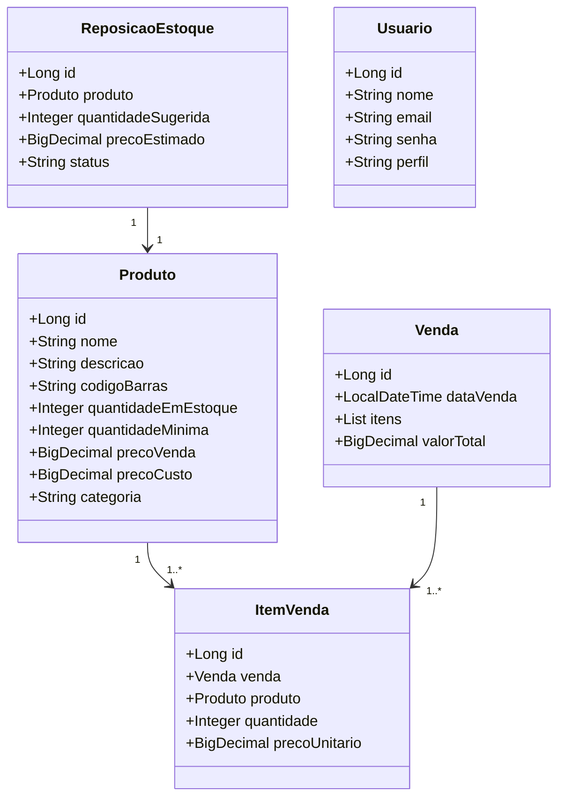
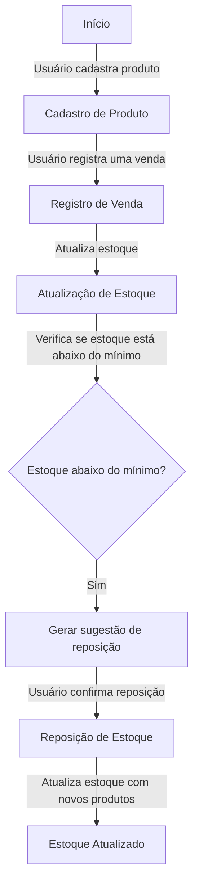

API de controle de estoque Inteligente para pequeno varejistas, que permite o cadastro de produtos e fornecedores. Além de dar uma visão geral dos produtos em estoque,  sugestão de reposição inteligente baseado em vendas passadas, sugerir quando repor produtos, assim como integração com fornecedores e buscar preços de produtos em tempo real. 

### 🔹 **Por que esse tema?**
1. **Aplicabilidade real**: Pequenos negócios precisam gerenciar seu estoque e repo-lo.
2. **Pode crescer**: Dá para adicionar uma "Inteligência real", com machie learning ou algo parecido.

### 🔹 **Principais funcionalidades da API**

✅ **Cadastro de Produtos**
- Criar, listar, atualizar e deletar produtos.

✅ **Controle de Estoque**
- Registrar entrada e saída de produtos.
- Alertas automáticos para estoque baixo.

✅ **Sugestão de Reposição Inteligente**
- Baseado em vendas passadas, sugerir quando repor produtos.

✅ **Integração com Fornecedores**
- Buscar preços de produtos em tempo real.

✅ **Autenticação e Segurança**
- Login com JWT para proteger endpoints.

### 🔹 Entidades
- **Produto:** 
```java
public class Product{
	private Long id;
	private String name;
	private Long quantity;
	private BigDecimal price;
	private LocalDateTime createdAt;
	private String category;
	private Supplier supplier;
}
```
- **Venda**
```java
public class Sale{
	private Long id;
	private LocalDateTime createdAt;
	private List<SaleItem> items;
	private BigDecimal valueTotal;
}
```
- **ItemVenda**
```java
public class SaleItem{
	private Long id;
	private LocalDateTime saleAt;
	private Product product;
	private int quantity;
	private BigDecimal unitaryPrice;
}
```
- **User**
```java
public class User{
	private Long id;
	private String name;
	private String email;
	private String password;
	private String role;
}
```

#### Diagrama de classe


### 🔹 Fluxograma

### 🔹 Step-by-step

1. [x] **Criar o projeto no Spring Boot usando o Spring Initializr**
2. [x] **Definir as entidades principais (Produto, Estoque, Venda, Fornecedor, Usuário)**
3. [ ] **Implementar os endpoints REST**
4. [ ] **Configurar autenticação e autorização**
5. [ ] **Adicionar lógica para sugestões de reposição**
6. [ ] **Testar e documentar a API**
7. [ ] **Implantar na Railway**
